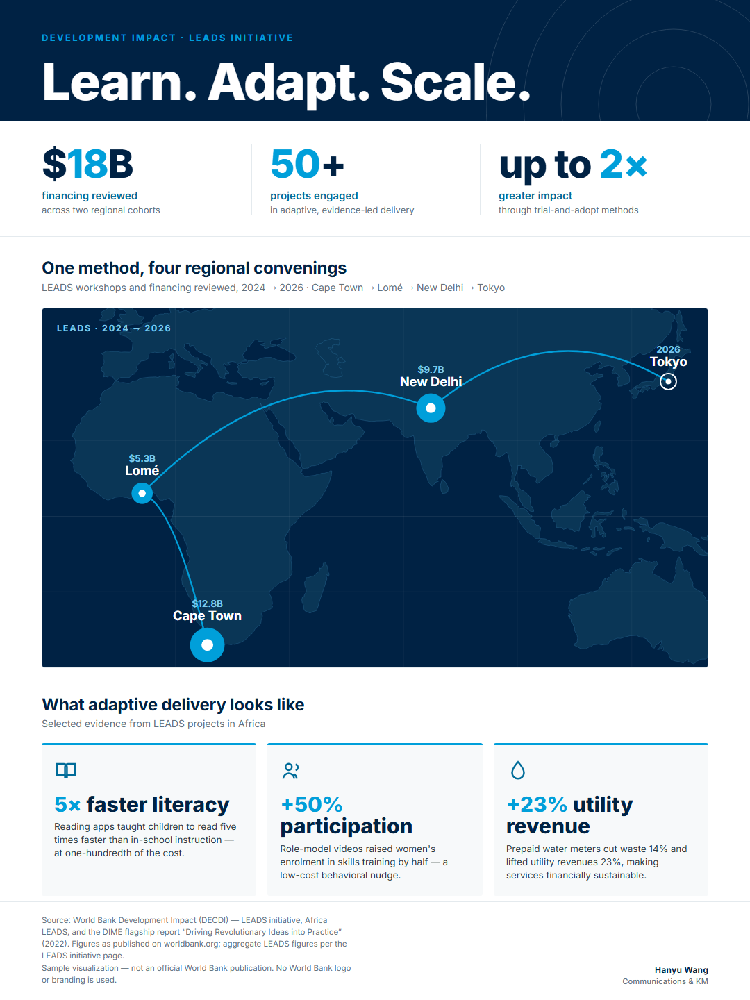
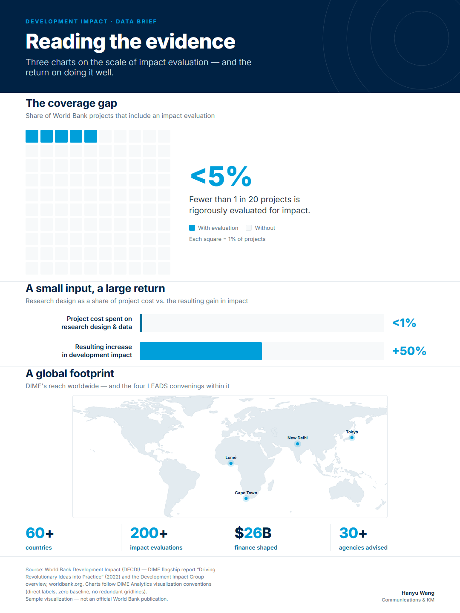
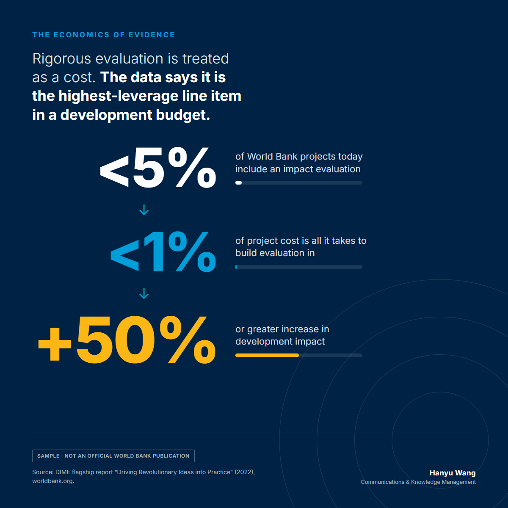
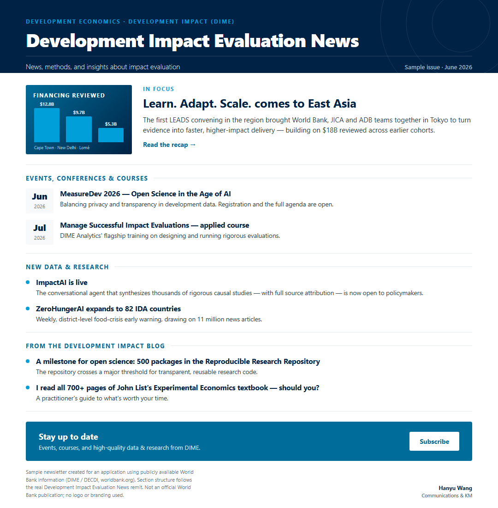
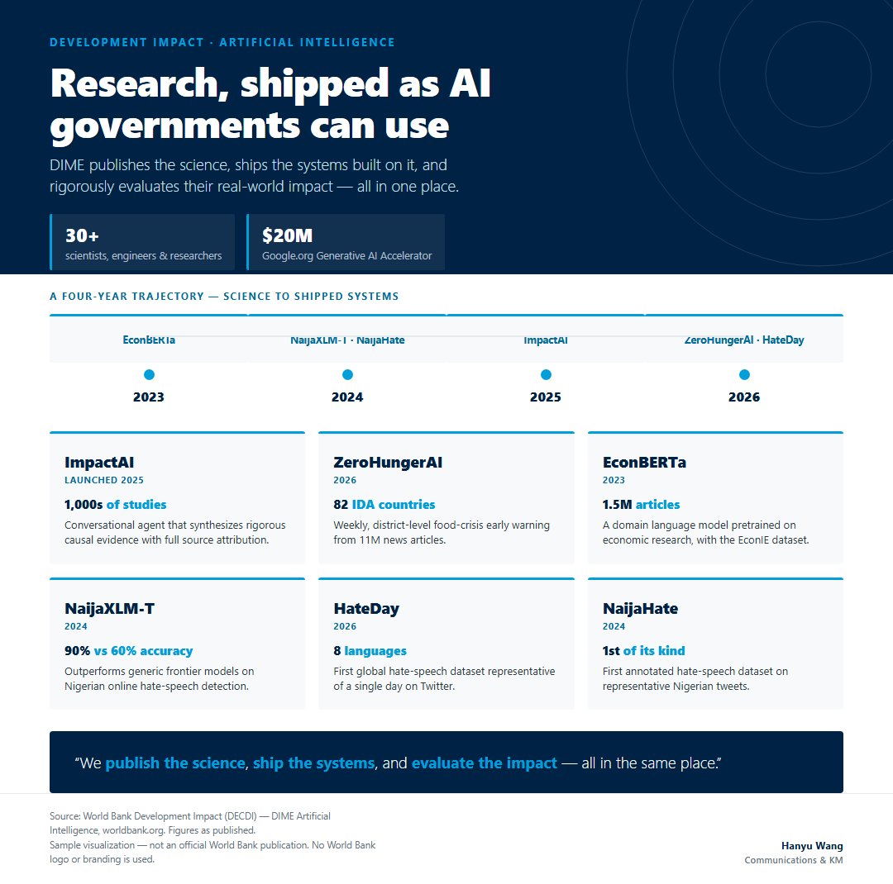
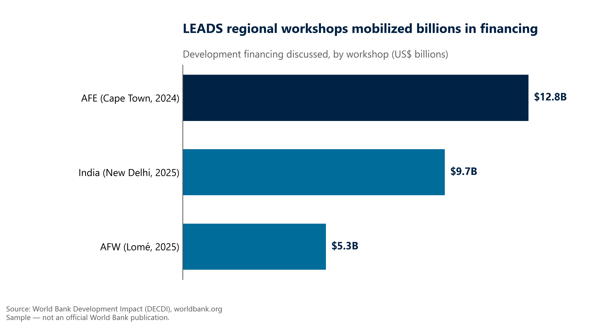
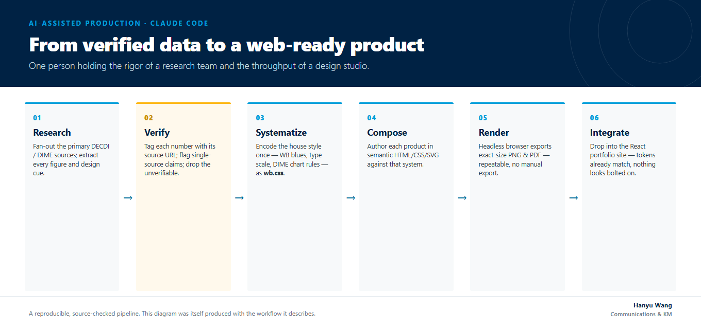

# WB DataViz Toolkit

**Two reusable workflows for producing World Bank / DIME-style knowledge products —
charts, infographics, social cards and newsletters — from public data.**

Pick the route that fits the deliverable: a **traditional Stata / R / Python charting
toolkit** for rigorous, reproducible exhibits, or an **AI-assisted content studio** for
composed, web-ready products. Both share the same house style (World Bank blues, direct data
labels, zero baselines, no chart-junk, a mandatory source note) and the same discipline:
every figure is traced to a public source before it ships.

> ⚠️ **Independent / unofficial.** This is illustrative spec work. Outputs are **not official
> World Bank publications** and use no World Bank logo or branding. "World Bank", "DIME" and
> "DECDI" marks belong to The World Bank Group. All data is from public worldbank.org sources.

---

## Gallery

Sample products built with the toolkit, all from public LEADS / DIME data:

| | |
|---|---|
| **Flagship infographic**<br> | **Report chart sheet**<br> |
| **Social card**<br> | **Newsletter**<br> |
| **DIME-AI product grid**<br> | **Traditional Python bar**<br> |

The AI studio pipeline that produces them:



---

## Which workflow for which deliverable

| | **Workflow 1 — Charting toolkit** | **Workflow 2 — Content studio** |
|---|---|---|
| Reach for it when you need | a statistical chart for a report/brief/slide | a composed product: infographic, social card, newsletter |
| Tools | Stata · R · Python (matplotlib / ggplot2) | HTML/CSS/SVG + a headless browser (+ Claude Code) |
| Reusable asset | house-style **theme files** — every new chart inherits the look in one line | a **design system** (`wb.css`) + parameterized **templates** + a render script |
| On-the-job move | drop a new CSV in `data/`, run, collect styled PNGs | copy the closest template, update the data block, render, ship |
| Folder | [`1-traditional-stata-r-python/`](./1-traditional-stata-r-python) | [`2-ai-claude-code/`](./2-ai-claude-code) |

---

## Quickstart

### Workflow 1 — Python (runs anywhere with Python 3.10+)
```bash
cd 1-traditional-stata-r-python/python
pip install -r requirements.txt
python leads_charts.py                  # -> output/*.png (300 dpi, DIME style)
python leads_charts.py path/to/your.csv # same style, your data
```
The house style lives in `dime_style.py` (palette + `dime_barh()` + `add_source_note()`),
so every chart is on-brand automatically. Equivalent **R** (`theme_dime.R`) and **Stata**
(`dime_scheme.do`) theme files are included.

### Workflow 2 — AI studio (Windows; needs Edge or Chrome)
```powershell
cd 2-ai-claude-code
./render.ps1 templates\01_leads_hero 1080 1440   # one template
./render.ps1 templates\03_linkedin_card 1200 1200
./render_all.ps1                                  # all templates -> ./renders/
```
Each `templates/*.html` keeps its numbers in a small **data block** near the top — update
those, re-render, and the PNG (and PDF for print) regenerate. `wb.css` encodes the house
style once, so a palette change propagates across every product.

---

## Design conventions (baked in)

- World Bank blues — Oxford `#002244`, Bright `#009FDA`, Mid `#006C99` — with a sparing gold
  accent. Inter as an Andes substitute.
- DIME chart rules: direct data labels (no legend when labeled), value axis starts at zero,
  no redundant gridlines, a mandatory "Source:" note, minimal chart-junk.
- A recurring map motif (real Natural Earth coastlines) ties the infographic set together.

## Data & provenance

All numbers are from public World Bank sources, verified before use; single-source figures
are flagged and anything unverifiable is dropped. See
[`data/DATA_SOURCES.md`](./data/DATA_SOURCES.md).

## Origin & license

Built by **Hanyu (Hilda) Wang** as spec work for a World Bank DECDI Knowledge Management &
Communications application, and shared here as a reusable toolkit. MIT licensed — see
[`LICENSE`](./LICENSE).
